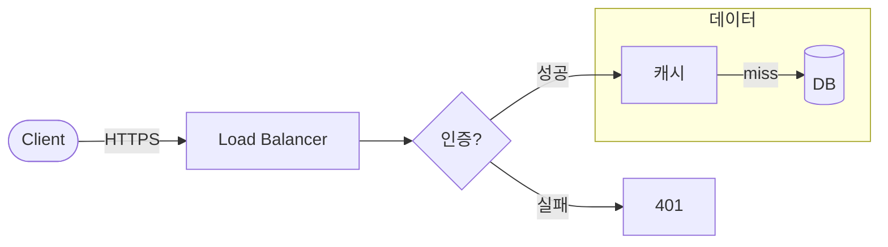

# 다이어그램 작업: $ARGUMENTS

자연어 설명을 슬라이드 다이어그램으로 만든다. **"보기 좋게"를 규칙으로 강제** — 작게·빽빽하게·읽기 어렵게 나오지 않도록.

## 덱·슬라이드 결정
1. 인자에 덱 이름이 있으면 그것. 없으면 `decks/.active` → 유일/최근 덱 → 모호하면 확인.
2. "14번 ~~" = 활성 덱의 `slides/14-*.md`.

## 도구 선택 (먼저 결정)
- **Mermaid** (HTML 전용 · 권장): 분기·서브그래프·시퀀스·계층 등 **그래프**. 빌드가 mermaid.js 주입해 런타임 렌더. PDF/PPTX엔 안 나옴.
- **CSS 박스 체인**: 일직선 흐름(A→B→C) 3~4단. 의존성0·전 포맷. 간단하면 이쪽.
- **미리 렌더 SVG/PNG**: 전 포맷에 꼭 보여야 할 때만.

## 시각 품질 규칙 (반드시 준수 — 이게 이 스킬의 핵심)
1. **방향 = 슬라이드에 맞춘다.** 슬라이드는 16:9 가로. → **기본 `flowchart LR`(좌→우)** 로 가로 폭을 채운다. *계층/트리·단계가 깊을 때만* `TD`(위→아래). 세로 `TD`는 가로 여백이 남아 작아 보인다.
2. **노드 수 ≤ 8** (이상이면 묶거나 슬라이드 분할). 한 슬라이드 한 다이어그램.
3. **라벨 짧게** — 노드 라벨 1~3단어. 문장 ❌. 화살표 라벨은 1단어(`hit`/`miss`/`성공`).
4. **노드 모양으로 종류 구분**: 처리 `[사각]` · 판단 `{마름모}` · 시작/끝 `([둥근])` · 데이터/DB `[(원통)]`. 일관되게.
5. **서브그래프**로 관련 묶음(계층/경계)을 시각적으로 그룹화.
6. **크기**: `themes/tech.css`의 `.mermaid`가 슬라이드 폭/높이(≤66vh)에 맞춰 자동 확대. 노드가 많아 작아지면 **노드를 줄여라**(폰트 키우기보다 단순화).
7. **색/테마**: 다크 테마 자동(빌드 주입). 슬라이드에서 색을 직접 지정하지 말 것(테마 일관성).
8. 다이어그램이 그 슬라이드의 **주인공**이면 제목 한 줄 + 다이어그램만. 불릿과 섞지 말 것.

## Mermaid 템플릿 (LR 기본)
````markdown
<!-- _class: content -->
## 제목 한 줄


````

## 진행
1. 덱·슬라이드 결정 → 대상 파일 읽기.
2. 설명을 위 규칙대로 다이어그램으로 번역(방향·노드수·라벨·모양 점검). 슬라이드 1장만 건드린다.
3. `node build.mjs <덱>` 빌드 → 에러·**넘침 경고** 없는지 확인.
4. **반드시 눈으로 검증**: `pv <덱>`(또는 `explorer.exe dist/<덱>.html`)로 해당 장을 열어 — 너무 작지 않은지, 라벨 안 잘리는지, 균형 잡혔는지 확인. 작으면 노드를 줄이거나 `LR`↔`TD`를 바꿔 다시.
5. 무엇을 어떤 도구·방향으로 그렸는지 보고.

> Mermaid·동적은 **HTML 출력에서만** 보인다. 전 포맷 필요하면 미리 렌더 SVG. 새 다이어그램 '종류'가 엔진에서 안 되면 `build.mjs` 확장이 필요하다고 알린다.
