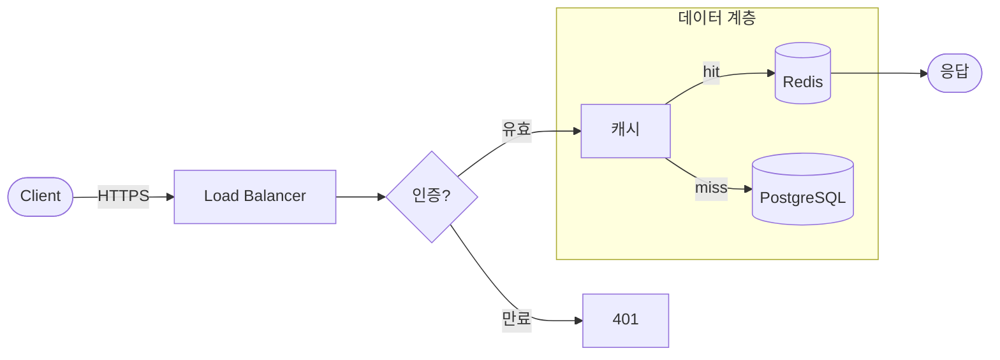

<!-- _class: content -->
## 다이어그램 — Mermaid (HTML 런타임 렌더)

```mermaid
flowchart LR
  U([Client]) -->|HTTPS| LB[Load Balancer]
  LB --> Q{인증?}
  Q -->|유효| C[캐시]
  Q -->|만료| E[401]
  subgraph data[데이터 계층]
    C -->|hit| R[(Redis)]
    C -->|miss| DB[(PostgreSQL)]
  end
  R --> RESP([응답])
```

분기·서브그래프·DB 노드까지 — ==CSS 박스로는 어려운 그래프== {.src}
