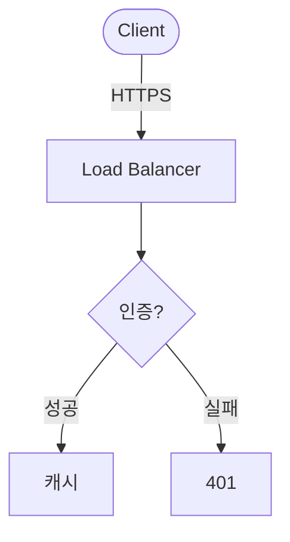

# 슬라이드 패턴 카탈로그

디자인은 2계층으로 저장한다 — **레이아웃**(슬라이드 전체 틀) + **컴포넌트**(슬라이드 안 부품).
새 슬라이드는 **먼저 여기서** 레이아웃을 고르고, 그 안에 컴포넌트를 끼운다.

- **레이아웃** = `<!-- _class: 이름 -->` 한 줄. 슬라이드당 **1개**. (CSS: `themes/base.css`의 `section.이름`)
- **컴포넌트** = `<div class="이름">`. 한 슬라이드에 **여러 개**. (CSS: `themes/base.css`의 `.이름`)
- 구조(레이아웃·컴포넌트)는 `themes/base.css`, 색·폰트는 팔레트(`themes/<name>.css`의 `:root`). 둘을 빌드가 합쳐 테마가 된다.

---

# A. 레이아웃 (13종)

PowerPoint의 "슬라이드 레이아웃/마스터"에 해당. 슬라이드 맨 위에 `<!-- _class: 이름 -->`.

| # | `_class` | 용도 |
|---|----------|------|
| 1 | `cover` | 표지(메인) |
| 2 | `section` | 챕터 구분 |
| 3 | `agenda` | 목차 (번호 강조) |
| 4 | `content` | 기본 본문 (상단 accent 바) |
| 5 | `two` | 좌우 2단 |
| 6 | `compare` | 비교 (좌 vs 우 패널) |
| 7 | `imgtext` | 이미지 + 설명 |
| 8 | `full` | 풀스크린 임팩트/이미지 |
| 9 | `quote` | 인용 · 한 문장 임팩트 |
| 10 | `metrics` | 지표 강조 (큰 숫자) |
| 11 | `blank` | 빈/자유 캔버스 |
| 12 | `end` | 마무리/CTA |
| 13 | `spotlight` | 배경 캡처를 죽이고 다크 카드(`.callout`)로 한 포인트 |

### 표지 · 섹션 · 목차
```markdown
<!-- _class: cover -->
<!-- _paginate: false -->
# 발표 제목
### 부제목 · 발표자 · 2026
```
```markdown
<!-- _class: section -->
# 1. 배경과 문제
```
```markdown
<!-- _class: agenda -->
## 목차
1. 배경
2. 방법
3. 결과
```

### 본문 · 2단 · 비교
```markdown
<!-- _class: content -->
## 제목
- 불릿 (6개 이하)
```
```markdown
<!-- _class: two -->
<div>

## 왼쪽
내용 A

</div>
<div>

## 오른쪽
내용 B

</div>
```
`compare`는 `two`와 같은 구조지만 각 `<div>`가 카드(박스)로 보인다.

### 이미지+설명 · 풀스크린 · 인용 · 지표
```markdown
<!-- _class: imgtext -->
<div>


</div>
<div>

## 설명 제목
- 포인트

</div>
```
```markdown
<!-- _class: full -->
# 풀스크린 임팩트
```
```markdown
<!-- _class: quote -->
# "한 문장으로 압축한 *핵심 메시지*"
```
```markdown
<!-- _class: metrics -->
## 결과
<div class="cols3">
<div class="metric"><span class="num">3.2x</span><span class="label">처리량</span></div>
</div>
```

### 빈/자유 · 마무리
```markdown
<!-- _class: blank -->
# 자유 배치 캔버스
```
```markdown
<!-- _class: end -->
# 감사합니다
### 질문 환영 · github.com/me
```

### 스포트라이트 (배경 죽이고 카드)
캡처/대시보드를 **흑백·블러로 죽이고** 그 위 다크 카드(`.callout`)로 한 포인트만 살린다. 같은 캡처에 카드만 1→2→3 으로 바꿔 **단계별 빌드업**(WhaTap 덱 패턴).
```markdown
<!-- _class: spotlight right -->     <!-- 카드 위치: 기본 좌 · spotlight center · spotlight right -->

   <!-- 배경 죽이기 = Marp 배경 필터 -->

::: callout
1 / 3 {.step}

## DB Connection 26.2초

mysql jdbc 획득 대기 — **거의 전부가 여기** 묶임
:::
```
- 배경은 **Marp 배경 필터**로 죽인다: `blur:Npx` · `grayscale` · `brightness:.5` · `sepia` 등 조합(이미지는 `assets/`에 두면 빌드가 인라인).
- `.callout`은 spotlight 없이 일반 슬라이드에서도 떠 있는 카드로 쓸 수 있다. 데모: `decks/showcase` 14·15번.

---

# B. 컴포넌트 (레이아웃 안에 끼우는 부품)

## 강조 박스 — `.box`
```markdown
<div class="box accent">

💡 **핵심 인사이트**: 한 문장 메시지

</div>
```
변형(테두리색): `box accent`(파랑) · `box warn`(주황) · `box danger`(빨강) · `box ok`(초록)
**채운 틴트** — before/after·비교쌍에. 테두리 변형과 조합: `box tint danger`(연빨강) · `box tint ok`(연초록) · `box tint warn` · `box tint`(연파랑). 틴트 박스 안 `# 큰숫자`는 의미색 자동(danger=빨강·ok=초록).
```markdown
<div class="cols">

::: box tint danger
**개선 전** · p95

# 3.0s
:::
::: box tint ok
**개선 후** · p95

# 0.3s
:::

</div>
```

## 콜아웃 카드 — `.callout` (+ `.step` 배지)
죽인 배경/캡처 위에 띄우는 **다크 카드**. `spotlight` 레이아웃(위 A)과 함께, 또는 일반 슬라이드 위에 단독으로.
```markdown
::: callout
1 / 3 {.step}        <!-- "1 / 3" 단계 배지(주황). 생략 가능 -->

## 한 줄 결론

부연 설명 — **핵심**만
:::
```
색은 `--callout-bg`/`--callout-fg`(기본 다크 네이비, 어느 팔레트에서도 떠 보이게). 데모: showcase 14번.

## 포커스 박스 — `.focus`
캡처/이미지의 한 영역(또는 인라인 구절)을 **강조색 외곽선**으로 가둔다.
```markdown
트레이스에서 <span class="focus">느린 SQL 한 줄</span> 을 잡으면 끝.
```

## 지표 카드 — `.metric` (+ `.cols3`)
```markdown
<div class="cols3">
<div class="metric"><span class="num">99.9%</span><span class="label">가용성</span></div>
<div class="metric"><span class="num">-40%</span><span class="label">지연</span></div>
<div class="metric"><span class="num">3.2x</span><span class="label">처리량</span></div>
</div>
```

## 다단 그리드 — `.cols` / `.cols3`
```markdown
<div class="cols"> ... </div>     <!-- 2단 -->
<div class="cols3"> ... </div>    <!-- 3단 -->
```

## 비교표 — 마크다운 테이블
```markdown
| 항목 | A | B |
|------|---|---|
| 속도 | 빠름 | 느림 |
```

## 코드 데모 — 펜스 코드블록
````markdown
```python
def build(): ...
```
````

## 동적·애니메이션 카탈로그 (HTML 발표 전용 · `/animate` 스킬이 작성)
**PDF/PPTX는 정지**. 4종 — 전환 / 등장 카운트업 / 등장 막대 / 인터랙티브 슬라이더.

**① 전환(transition)** — 그 장에 들어올 때. 전역은 `_header.md`의 `transition: fade`.
```markdown
<!-- transition: slide -->     ← 이 슬라이드 진입 전환 (fade·slide·cover·reveal 등)
```

**② 등장 카운트업** — 슬라이드 활성화 시 0→값 1회.
```markdown
가용성 <span class="count" data-to="99.9" data-suffix="%">0</span>
```
옵션: `data-from` · `data-prefix` · `data-suffix` · `data-dur`(ms)

**③ 등장 막대** — 활성화 시 차오름. 색: 기본/`.warn`/`.danger`.
```markdown
<div class="bar" data-pct="80" data-label="Python"></div>
```

**④ 인터랙티브 슬라이더(`.sim`)** — 슬라이더로 변수를 바꾸면 수치·막대가 **실시간** 갱신.
```html
<div class="sim" data-var="pool" data-min="1" data-max="50" data-value="10">
<label class="sim-ctrl">커넥션 풀 <span class="sim-now"></span><input type="range"></label>
<div class="sim-row"><span>처리량</span><div class="bar" data-expr="min(100, pool*6)"></div><b class="sim-out" data-expr="pool*120" data-suffix=" req/s"></b></div>
</div>
```
`data-expr` = Math 함수 + 변수(`data-var`)로 계산. `.bar`는 0~100(%), `.sim-out`은 숫자(`data-suffix`·`data-dec`).

## 다이어그램 — 셋 중 택1

**① CSS 박스 체인** (의존성 0 · 모든 포맷 · 간단한 일직선 흐름)
```markdown
<div class="cols3">
<div class="box accent">Client</div>
<div class="box accent">API</div>
<div class="box accent">DB</div>
</div>
```

**② Mermaid** (HTML 전용 · 분기·서브그래프·시퀀스 등 복잡한 그래프) — 빌드가 ```` ```mermaid ```` 블록을 `<div class="mermaid">`로 바꾸고 mermaid.js를 주입해 **브라우저가 런타임 렌더**(`.count`·`.bar`·`.sim`과 같은 HTML 전용 패턴, **PDF/PPTX엔 안 나옴**). 다크 테마 자동.
````markdown

````
> mermaid.js는 로컬 설치(`npm i mermaid`) 시 인라인(self-contained), 없으면 CDN 로드. 데모: `decks/example` 14번.

**③ 미리 렌더한 SVG/PNG** (모든 포맷에서 보여야 할 때) — `assets/`에 넣고 ``.

---

# B-2. 마크다운 친화 문법 (markdown-it 플러그인)

빌드 엔진에 3개 플러그인이 켜져 있다(`marp.config.mjs`). HTML 래퍼 없이 클래스를 붙이는 게 핵심.

**① attrs — 요소에 `{.클래스 #아이디 key=값}` 직접 부여**
```markdown
무중단 배포가 핵심 {.box .accent}        ← 문단에 클래스
{width=400 .shadow}  ← 이미지 크기·클래스
출처: Gartner, 2025 {.src}               ← 출처 캡션(.src = 작은 회색)
```

**② container — `::: 클래스` … `:::` → `<div class="클래스">`** (여러 줄 마크다운을 담을 때)
```markdown
::: box warn
- 롤백 계획 **필수**
- DB 마이그레이션은 별도 배포
:::
```
→ 기존 `<div class="box warn"> … </div>` (빈 줄 들여쓰기 필요)와 동일 결과. 블록 문법이 더 깔끔.
`::: ` 뒤 문자열이 그대로 class 가 됨 → `themes/base.css`의 어떤 클래스든 사용 가능(`cols`, `compare` 패널 등).

**③ mark — `==형광펜==` → `<mark>`** : `**파랑**`(strong)·`*초록*`(em)에 이은 세 번째 강조(주황 형광펜).

> HTML `<div class>` 방식도 그대로 동작한다. 새 슬라이드는 위 문법을 우선 쓰되, 둘은 결과가 같다.

### content ↔ design 소유 경계 (동결 규칙의 기준)
인라인 문법은 '말'과 '디자인'이 한 줄에 섞이므로 **누가 건드릴지**를 구문으로 가른다:
- **강조 `**굵게**`·`*초록*`·`==형광펜==`** = **내용**(`/content` 소유). 무엇을 강조할지는 글 작성자 결정.
- **클래스 마커 `{.box .accent}`·`::: ... :::`·`<div class>`·`<!-- _class -->`** = **디자인**(`/design` 소유).
- `/content`는 마커를 **그 자리에 두고 안의 글자만** 바꾼다 — `치킨 {.box}` → `피자 {.box}`(마커 위치 유지 = 박스 유지). 의미 판단 불필요.
- **단어에 딱 붙인 인라인 attrs(`치킨{.accent}`)는 쓰지 말 것** — 글자와 융합돼 경계가 모호해진다. 강조는 `**`/`*`/`==`로, 박스·레이아웃은 **공백 띄운 블록 마커**(`{...}` 줄 끝 / `:::`)로.

---

# C. 새 패턴 추가 / 컴포넌트 승격 규칙

새로 자주 쓰는 패턴이 생기면:
1. 위 형식으로 추가 (레이아웃이면 A, 부품이면 B)
2. `themes/base.css`에 `section.이름`(레이아웃) 또는 `.이름`(컴포넌트) 클래스 추가 — 색은 직접 쓰지 말고 `var(--*)`로(모든 팔레트에서 자동으로 맞도록)
3. 필요하면 `decks/showcase`에 데모 한 장 추가

**언제 공용으로 뺄까 (승격 기준):** "내용(말)이 빠진 채 다른 발표에서도 또 쓸 일반적 모양"이면 공용으로.
①2~3번 반복 ②내용 독립 ③재사용 범위 ④한 단어 이름 가치 ⑤일관성. 너무 이른 추상화 금물(3번째 쓸 때 승격).

> 데모는 `decks/showcase` 덱에서 모든 레이아웃을 한 장씩 확인 가능: `node build.mjs showcase` → `dist/showcase.html`
